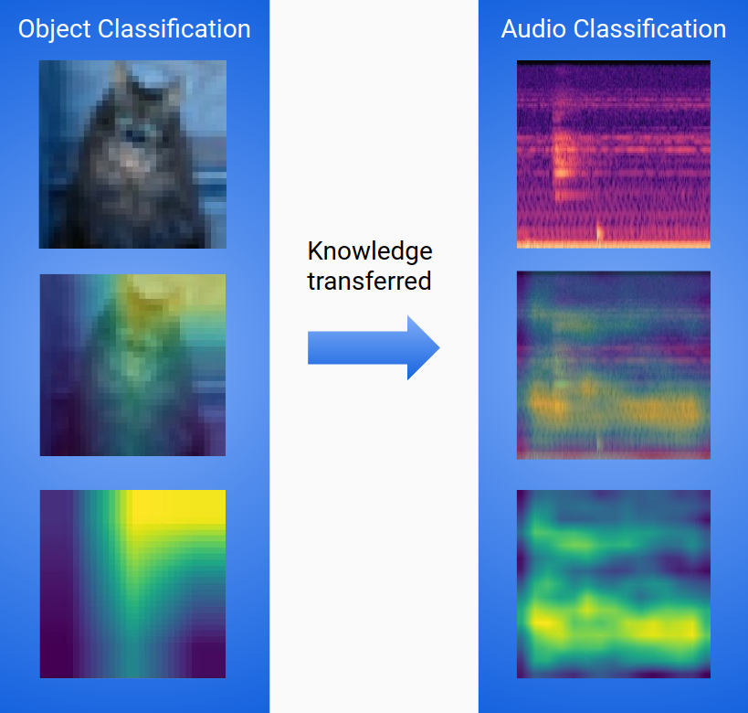
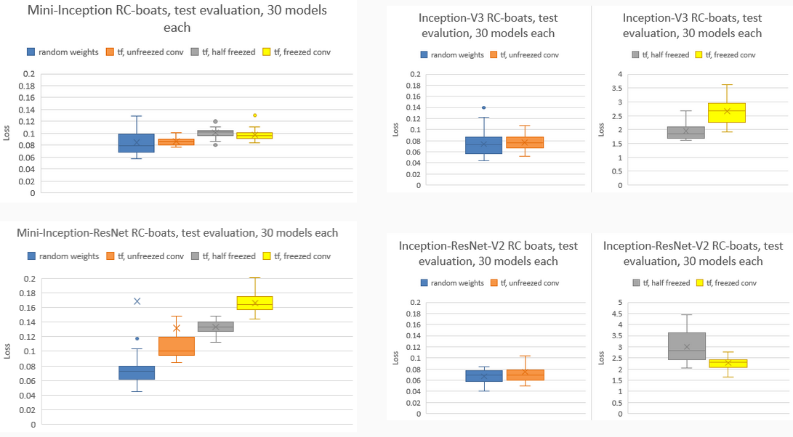
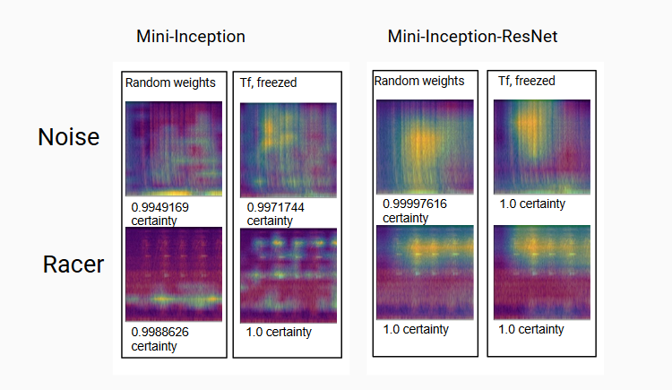
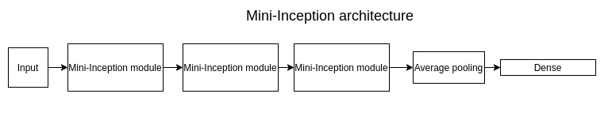
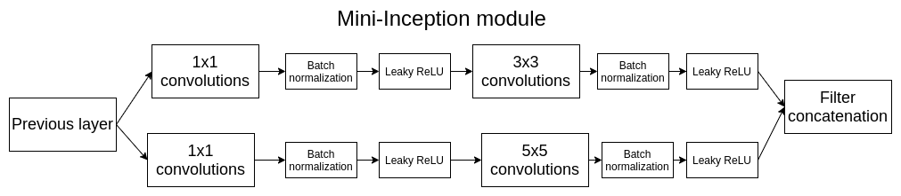
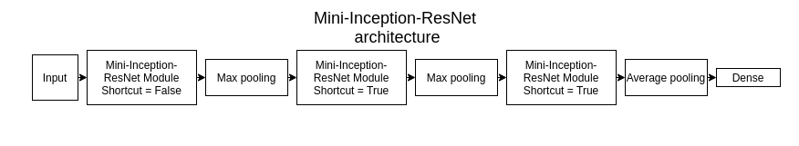
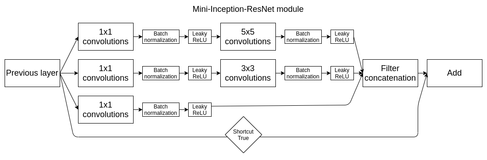

<h1 align="center">Transfer learning between domains</h1>

 

<h3 align="center">Test set evaluation</h3>

<h3 align="center">Validation</h3>

 

<h3 align="center">Implemented CNN architectures<h3>

<h4 >>Mini-Inception</h4>

<h4>>Mini-Inception-ResNet</h4>

